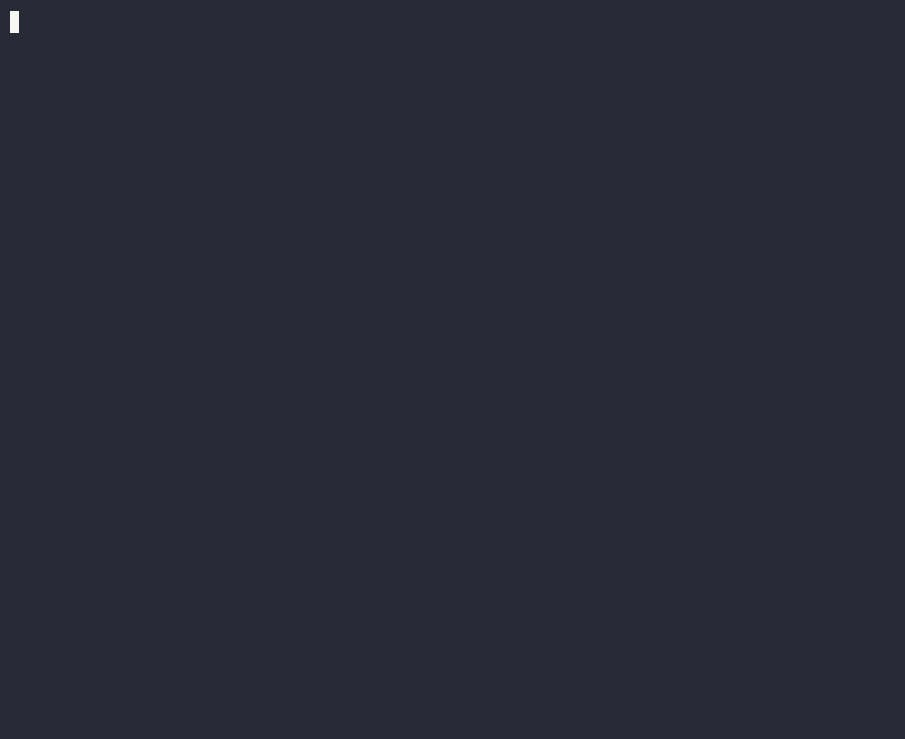
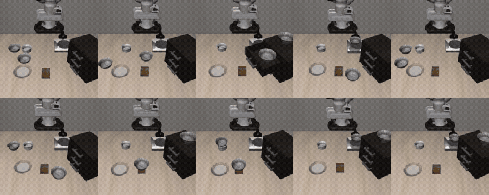

<!-- 中文为默认文档；English: README.en.md -->

# BLLM — RDK BPU 端侧大模型框架

[](LICENSE)
[](CMakeLists.txt)
[](python/CMakeLists.txt)
[-0A7BBB.svg)](#快速上手)
[](CHANGELOG.md)

**简体中文** | [English](README.en.md)

> ### 几分钟在板子上跑起一个端侧大模型。
> 统一的 C++ / Python 会话式 API：对话、流式、多模态、结构化输出、OpenAI 服务，
> 全部落在板载 BPU 上。**跑在官方通用运行时之上，不需要额外的大模型 SDK。**

```python
import bllm

llm = bllm.load("~/models/qwen3.5-2b")           # 一个目录 = 一个模型
for chunk in llm.stream_chat("用一句话介绍北京"):
    print(chunk, end="", flush=True)
```

```bash
conda install -c https://mirrors.ruis.ai/conda -c conda-forge bllm
```

它是视觉框架 [**bcdl**](https://github.com/ruisv/bcdl)（RDK BPU 视觉推理）的大模型姊妹库，
两者共享同一块 BPU 并可协同调度。

<p align="center">
  <br>
  <em>Qwen3.5-2B VLM（图文，混合 SSM + 自建视觉塔，ctx4k）在 RDK S100P BPU 上原生流式对话，中英双语，第二轮不重新给图也能准确数出遥控器数量</em>
</p>

**导航：**
[为什么用](#为什么用-bllm) ·
[具身策略（VLA）](#具身策略π05-跑在-bpu-上) ·
[与官方运行时的关系](#与官方运行时的关系) ·
[架构](#架构) ·
[快速上手](#快速上手) ·
[能做什么](#能做什么) ·
[服务化部署](#服务化部署openai-兼容-http) ·
[多模态](#多模态) ·
[与视觉共享 BPU](#与视觉流水线共享-bpu) ·
[性能](#性能) ·
[支持的模型](#支持的模型) ·
[能力清单](#能力清单) ·
[从源码构建](#从源码构建) ·
[社区交流](#社区交流)

## 为什么用 BLLM

端侧跑大模型，难的不是"推理一次"，而是：模型目录怎么组织、停止符从哪来、
ChatML 模板怎么拼、KV / SSM 缓存怎么管、多轮怎么不越界、采样怎么可复现、
输出的 JSON 怎么保证能解析、要对外提供服务怎么办、和视觉任务抢 BPU 怎么办。
BLLM 把这些做成默认行为。

- **✅ 一行加载** —— `bllm.load(dir)`：自动识别模型类型、发现对话模板、按权威性
  解析停止符（猜错 eos 的下场是模型**永不停止**），裸 `.hbm` 也能直接吃。
- **✅ 一行安装** —— 预编译 conda 包（Python 3.9–3.14），板上不需要编译。
- **✅ 统一的会话 API** —— 对话 / 流式 / 多轮 / 采样 / 多模态用同一套接口，
  C++ 与 Python 对等；换模型不换代码。
- **✅ 结构化输出是保证，不是请求** —— GBNF 语法约束 + JSON Schema → 语法，
  **解码期**就只允许仍能满足语法的 token，所以 `json.loads()` 不会失败。
- **✅ 开箱即用的服务化** —— OpenAI 兼容 HTTP（流式 + 非流式）+ Docker 镜像 +
  对话前缀缓存（板上实测 31.6s → 1.3s，约 25×）。
- **✅ 覆盖官方没覆盖的架构** —— Qwen3.5 混合 Gated-DeltaNet/SSM 严格 100% 落 BPU
  （**BLLM 原生独有**），另有 GLM-Edge、Phi-4-mini。
- **✅ 能和视觉共存** —— 单 BPU 核上把 LLM 优先级压低，同驻检测器的 p99 从 41 ms
  降到 **2.95 ms**，不是"各跑各的然后互相拖死"。
- **✅ 不止于对话：具身策略也在 BPU 上** —— π0.5 与 SmolVLA 两个视觉-语言-动作模型
  一行加载，板上成绩与 x86 参考持平（下一节）。**官方运行时不覆盖这一类。**

## 具身策略：π0.5 跑在 BPU 上

端侧大模型不只是聊天。BLLM 把 π0.5 这类**视觉-语言-动作（VLA）模型**整条搬到了
BPU 上——这是官方大模型运行时不提供的一类能力，也是把板子从"能问答"推到
"能动手"的关键一步。

<div align="center">
  <br>
  <sub>libero_spatial 板上 <b>99/100</b>，与 x86 参考持平（99/100）；<b>1016 ms/动作块</b>，全程在 BPU</sub>
</div>

```python
import bllm

policy = bllm.load_policy("~/models/pi05-libero-224-s100p")
actions = policy.act(scene_rgb, wrist_rgb, "pick up the black bowl")  # 10×7 动作块
```

两帧相机图 + 一句英文指令 → 10×7 末端 delta 动作块。三张图（4.57 GB）同时常驻，
**进程 RSS 仅 16 MB**（权重在 BPU/ION）、**推理时只占 6 核里约 1.3 核**——CPU 留给
感知与控制。模型包自带 tokenizer / embedding 表 / 动作分位数，运行时不依赖 openpi。

三个 suite 板上成绩：`libero_spatial` **99/100**（x86 参考 99/100）、`libero_goal`
97/100、`libero_object` 95/100。其中 spatial 那一行是**用模型包本身**（`bllm.load_policy()`
直连 openpi harness、不经它的任何 transform）打的分——也就是你装上以后会走的同一条路径。
另两个 suite 的回放与板上实测数据见 [π0.5 文档](docs/PI05.md)。

**📦 [ruisv/bllm-pi05-libero-224-s100p](https://huggingface.co/ruisv/bllm-pi05-libero-224-s100p)** —
下载即可 `bllm.load_policy()`（5.3 GB，三张 `.hbm` + embedding 表 + tokenizer + 清单）。

### SmolVLA —— 同一套 API，S100P 和 S600 都跑

[LeRobot](https://github.com/huggingface/lerobot) 的 SmolVLA 是第二个搬上来的 VLA，
也是**第一个同时给两块板出货**的模型。它比 π0.5 小得多，一个动作块给 **50 步**动作。

```python
policy = bllm.load_policy("~/models/smolvla-libero-512-s100p")   # 或 ...-s600
actions = policy.act(scene_rgb, wrist_rgb, "pick up the black bowl",
                     state=eef_state)                            # 50×7 动作块
```

| libero_spatial | S100P | S600 | 参考（RTX 4090） |
|---|---:|---:|---:|
| 成功率 | **70/100** | **71/100** | 73/100 |
| 每动作块 | 741 ms | **285 ms** | 500 ms |
| 三图常驻 | 1.43 GB | 0.43 GB | — |

三者用**同一套 harness**打分（同环境、同初始状态、同种子、同协议，只换算 chunk 的
那一侧）。n=100 时二项标准误 4.6 个百分点，三者不可区分；而且**逐任务分布一致**
——板子失手的任务正是参考失手的任务。**70% 是这个 checkpoint 的成绩，不是移植损失。**

与 π0.5 的一个实质差别：**SmolVLA 真读本体感**，`state` 会被投影成 prefix token，
不传等于换了个观测（实测差 2.0，整整一格夹爪）。

**📦 [ruisv/bllm-smolvla-libero-512](https://huggingface.co/ruisv/bllm-smolvla-libero-512)** —
一个仓两块板（`s100p/` 与 `s600/`）。转换管线完整开源在
[bllm-model-zoo](https://github.com/ruisv/bllm-model-zoo/tree/main/models/smolvla-libero/convert)，
Hub 上约 100 个 SmolVLA 微调架构相同，换个 `--ckpt` 就能转自己的。

## 与官方运行时的关系

BLLM 的算力同样来自 D-Robotics 官方 BPU 运行时（`hbDNN` / `hbUCP`），也同样
可以直接吃官方发布的 `.hbm`。下表比较的是**抽象层次与定位**，不是优劣：

| | 官方 OE-LLM 运行时（示例级） | BLLM |
|---|---|---|
| 形态 | 独立的大模型运行时 + 示例程序 | 可复用的框架，直接跑在通用 hbDNN / hbUCP 上，**无需额外大模型 SDK** |
| 接口 | 以 C API 为主 | C++17 库 + Python 绑定，任务式会话 API |
| 加载模型 | 按示例的路径与参数组织 | `bllm.load(dir)` 一行；`bllm-make-model-dir` 生成清单并解析停止符 |
| 模型覆盖 | 官方发布的 `.hbm` | 官方 `.hbm` **加上**官方未覆盖的架构（Qwen3.5 混合 SSM / GLM-Edge / Phi-4-mini） |
| 会话 | 模板、历史、缓存自己拼 | 内置 C++ tokenizer、ChatML 模板、多轮、流式、提示缓存 |
| 生成控制 | 基础采样 | 全套采样 + `logit_bias` + `logprobs` + GBNF 语法约束 |
| 服务化 | 自行搭建 | OpenAI 兼容 HTTP + Docker + 前缀缓存 + `/metrics` |
| 与视觉共存 | 自行处理 | BPU 优先级 / 时间片控制，与 [bcdl](https://github.com/ruisv/bcdl) 协同 |
| 具身策略（VLA） | 不覆盖 | π0.5 与 SmolVLA 一行加载并出动作块（[上一节](#具身策略π05-跑在-bpu-上)） |

一句话：**官方运行时证明了 BPU 能跑大模型；BLLM 让你几分钟内把它做成产品。**

## 架构

```
              你的应用 / OpenAI 兼容客户端
                          ↓
   ┌───────────────────────────────────────────────┐
   │  BLLM                                          │
   │  会话与模板 · 采样与语法约束 · KV/SSM 缓存      │
   │  视觉塔与多模态 · 前缀缓存 · HTTP 服务          │
   └───────────────────────────────────────────────┘
                          ↓
        D-Robotics hobot 运行时（官方，通用）
                 hbDNN · hbUCP
                          ↓
                     BPU "Nash"
```

自建的原生推理引擎：解码循环、KV / SSM 缓存、采样器、tokenizer 都在 BLLM 里，
下面只依赖板子本来就有的通用 BPU 运行时 —— 和视觉栈用的是同一个驱动，
所以两者可以同板共存、互相调度。

## 快速上手

### 1. 装（一分钟）

板上（aarch64，conda 环境）直接从我们的 conda 源安装：

```bash
conda install -c https://mirrors.ruis.ai/conda -c conda-forge bllm
```

装上 `bllm`（Python 绑定）、`libbllm`（C++ 库 + 头文件 + cmake 配置）及其运行时依赖
（`hobot-dnn`、`tokenizers-cpp`）。RDK 平台运行库随板系统提供。

还需要**一次性**把 ION carveout 调大，然后重启 —— 模型权重活在 ION 里而不是进程 RSS，
carveout 不够时运行时会在 alloc 处直接**段错误**：

```bash
sudo /usr/hobot/bin/hb_switch_ion.sh balanced && sudo reboot   # ≤3B；7B 用 bpu_first
```

性能模式不跨重启保持，每次开机设一遍（见 [`docs/MODELS.zh.md`](docs/MODELS.zh.md)）。

### 2. 拿一个模型（一分钟）

最快的一条：**下载我们编译好、可直接 `bllm.load()` 的模型包**（文件名已标注
上下文长度 / 目标板子 / 量化位宽）。Qwen3.5 图文（VLM，S100P，ctx4k/ctx512 两档）发布在
Hugging Face，附带完整验收数据的 model card：

**📦 [ruisv/bllm-qwen3.5-0.8b](https://huggingface.co/ruisv/bllm-qwen3.5-0.8b) ·
[ruisv/bllm-qwen3.5-2b](https://huggingface.co/ruisv/bllm-qwen3.5-2b) ·
[ruisv/bllm-qwen3.5-4b](https://huggingface.co/ruisv/bllm-qwen3.5-4b)**

```bash
sha256sum -c qwen3.5-4b-ctx512-int8-s100.tar.gz.sha256   # 完整性校验
tar xzf qwen3.5-4b-ctx512-int8-s100.tar.gz
```

转换方法论、验收协议、被拒绝的构建版本见
[bllm-model-zoo](https://github.com/ruisv/bllm-model-zoo)。

已经有官方发布的 `.hbm`？用 `bllm-make-model-dir` 拼成模型目录即可，见
[制作模型目录](#制作模型目录)。

### 3. 跑（一分钟）

```python
import bllm

llm = bllm.load("qwen3.5-4b-ctx512-int8-s100")   # 目录，或 裸 .hbm + tokenizer_dir=
llm.set_sampling(temp=0.7, top_p=0.9)            # 不设即贪心
for chunk in llm.stream_chat("用一句话介绍北京"):   # 流式、多轮
    print(chunk, end="", flush=True)
print(llm.last_decode_tps)
```

C++：

```cpp
#include "bllm/native_llm.h"
bllm::NativeLlm llm("/path/to/qwen2.5-1.5b");
std::string reply = llm.chat("你好", 400, [](const std::string& s){ std::cout << s << std::flush; });
```

REPL：`bllm_chat_native --model <dir>`（见 [`examples/chat_native.cc`](examples/chat_native.cc)）。

> 📖 完整 API 文档：Python [中文](docs/API.zh.md) · [English](docs/API.en.md)｜C++ [中文](docs/CPP_API.zh.md) · [English](docs/CPP_API.en.md)

## 能做什么

| 能力 | 一句话用法 | 示例 |
|---|---|---|
| **对话 / 流式** | `llm.chat(...)` · `llm.stream_chat(...)` | [`chat_native.cc`](examples/chat_native.cc) · [`native_session.py`](examples/native_session.py) |
| **多轮与上下文** | 会话自持历史，`llm.context_left` 跟踪剩余额度 | [`docs/API.zh.md`](docs/API.zh.md) |
| **采样** | `llm.set_sampling(temp=…, top_p=…, …)`，可复现 | [采样参数速览](docs/API.zh.md) |
| **结构化输出** | `llm.set_grammar("root ::= …")` / JSON Schema | [`docs/API.zh.md`](docs/API.zh.md) |
| **图文（VLM）** | `vlm.chat("描述这张图", images=["a.jpg"])` | [`vlm_native.py`](examples/vlm_native.py) · [`qwen35_native.cc`](examples/qwen35_native.cc) |
| **文 / 图 / 音 / 视频** | Qwen2.5-Omni，路径或原始数组（相机/麦克风零拷贝） | [`vlm_native.cc`](examples/vlm_native.cc) |
| **文本嵌入** | `NativeEmbedder`（Qwen3-VL-Embedding；C++ API，暂无 Python 绑定） | [`embed_native.cc`](examples/embed_native.cc) |
| **具身策略（VLA）** | `bllm.load_policy(...).act(图, 腕部图, "指令")` → 动作块 | [上文](#具身策略π05-跑在-bpu-上) · [π0.5 文档](docs/PI05.md) · [`pi05_policy.cc`](examples/pi05_policy.cc) · [`smolvla_policy.cc`](examples/smolvla_policy.cc) |
| **服务化** | OpenAI 兼容 HTTP + Docker | [`docker/README.md`](docker/README.md) |
| **与视觉共享 BPU** | `llm.set_bpu_priority(0)` | [与视觉流水线共享 BPU](#与视觉流水线共享-bpu) |

## 制作模型目录

一个模型是一个**目录**（`.hbm` + `tokenizer.json` + `model.json` 清单）。下载的官方模型
（`.hbm` 散在 `model/`、tokenizer 散在 `config/`）用 `bllm-make-model-dir` 拼成这个目录 ——
它随 `bllm` 包一起装好，不必 clone 本仓（等价形式：`python -m bllm.make_model_dir`；
源码树里是 `scripts/make_model_dir.py`）：

```bash
R=<sdk>/oellm_runtime
bllm-make-model-dir dense ~/models/qwen2.5-1.5b \
    --hbm       $R/model/Qwen2.5_1.5B_Instruct_1024.hbm \
    --tokenizer $R/config/Qwen2.5_1.5B_Instruct_config/tokenizer.json \
    --cache-len 1024
```

**别手写 `model.json`** —— 该工具会按权威性依次从 `generation_config.json`、
tokenizer 声明的 special token 解析停止符并打印用了哪个来源。猜错 eos 的下场是模型永不停：
Qwen2.5 的词表里就有一个 id 128247 的字面量 `</s>`，它并不是停止符。

三种 `arch`：`dense`（上面）、`hybrid`（Qwen3.5 SSM，另需 `--embed`）、
`omni`（[多模态](#多模态)，另需塔与嵌入表）。官方包结构、ION 设置等完整部署步骤见
[`docs/MODELS.zh.md`](docs/MODELS.zh.md)。

## 服务化部署（OpenAI 兼容 HTTP）

把运行时打包成 OpenAI 兼容的推理服务（`/v1/chat/completions`，流式 + 非流式），容器化部署在板上。
完整说明见 [`docker/README.md`](docker/README.md)。

**自包含镜像（模型烤进去，开箱即用）** —— `docker run` 直接对话，无需挂载模型：

```bash
cd docker
./bake-model.sh ~/models/qwen3.5-2b bllm-serve:qwen3.5-2b-ctx512-int8-s100p
docker run -d --network host \
  --device /dev/bpu --device /dev/bpu_core0 --device /dev/ion \
  --device /dev/ipcdrv --device /dev/dcore0_rpmsg_bpu \
  bllm-serve:qwen3.5-2b-ctx512-int8-s100p
```

**模型无关镜像（模型走 volume，一个镜像跑任意模型）** —— 用 docker compose：

```bash
cd docker && ./stage-libs.sh
MODEL_DIR=~/models/qwen3.5-2b docker compose up -d --build
```

服务默认监听 `:8866`，已开 CORS。用任意 OpenAI 兼容客户端指向 `http://<板子IP>:8866/v1` 即可
（[chatbox-lite](https://github.com/lfbear/chatbox-lite)、桌面 Chatbox、Open WebUI、OpenAI SDK…）：

```bash
curl localhost:8866/v1/chat/completions -H 'Content-Type: application/json' \
  -d '{"messages":[{"role":"user","content":"你好"}]}'
```

服务端会**缓存对话前缀**：OpenAI 协议无状态、客户端每轮重发全部历史，服务端只 prefill
新增部分。命中量在 `usage.prompt_tokens_details.cached_tokens`，整体统计看 `GET /metrics`。
匹配是逐 token 精确前缀比对，改了历史只会不命中并退化为全量 prefill，不会给出错答案。
板上实测：hybrid（Qwen3.5）31.6s → 1.3s（~25×），dense TTFT 274 → 141 ms。
一次只跑一个生成（单 BPU 图），排队超过 `BLLM_MAX_QUEUE` 返回 429。
详见 [`docker/README.md`](docker/README.md)。

## 多模态

两条路：官方 Qwen2.5-Omni（文/图/音/视频），以及 **Qwen3.5 图文**（我们自己编的视觉塔）。

### Qwen3.5 图文

Qwen3.5 官方就是 image-text-to-text —— 纯文本的包只是编译时把视觉半边丢掉了。
同一个 hybrid 文本 `.hbm` 配上视觉塔即可（视觉塔离线转换，成品包直接可用）：

```bash
bllm-make-model-dir hybrid ~/models/qwen3.5-0.8b-vlm448-ctx2k \
    --hbm qwen35_0.8b_ctx2k.hbm --embed embed_fp16.bin --tokenizer tokenizer.json \
    --visual qwen35_visual_448.hbm --hbm-prefill qwen35_prefill_n32.hbm \
    --mrope-section 11 11 10 --mrope-interleaved \
    --vision-patch 16 --vision-mean 0.5 --vision-std 0.5 --cache-len 2048
```

```python
vlm = bllm.load("~/models/qwen3.5-0.8b-vlm448-ctx4096-int8-s100p")
print(vlm.chat("Describe this image in one sentence.", images=["bears.jpg"]))
# -> Two brown bears walk across a dusty, arid landscape.

vlm.set_thinking(False)                       # 直接给答案，跳过 <think>...</think> 推理过程
m = bllm.load("~/models/qwen3.5-0.8b-vlm448-ctx4096-int8-s100p", vision=False)
print(m.chat("介绍一下你自己"))                 # 强制走纯文本会话，视觉塔权重完全不加载
```

S100P 实测（0.8B，含分块 prefill 图）：

| 桶 | token/图 | 塔输出 cosine vs HF fp32 | 首字延迟 |
|---|---|---|---|
| 320×320（更快，推荐） | 100 | 0.9987 | **1.23 s** |
| 448×448 | 196 | 0.99654 | **2.30 s** |

> ⚠️ 后四个参数**必填且不能照抄 Omni**（patch 16 vs 14、mean/std 0.5 vs CLIP、
> rope 分段 `11 11 10` vs `16 24 24`、频率布局 interleaved vs 连续）。编译好的 `.hbm`
> 里看不出这些，配错只会得到**形状正确的垃圾**。尤其 `--mrope-interleaved`：
> `t==h==w` 时两种布局完全等价，所以纯文本一切正常，**只有喂进图像之后位置才开始错**。
>
> ⚠️ 首字延迟的大头是把视觉行喂进文本模型，**不是视觉塔**（448 塔 encode 仅 0.36 s）。
> 分块 delta-rule 的 prefill 图（`--hbm-prefill`）把逐 token 摄入摊薄到秒级，分辨率越低越快。
>
> 目前只支持**静止图像**：视频路径实现的是 Omni 的 TMRoPE，而 Qwen3.5 用时间戳 token
> 分隔帧，传 `videos=` 会明确报错而不是悄悄编出顺序错乱的答案。

### Qwen2.5-Omni（文/图/音/视频）

官方发布的 Omni 是**三个塔 + 一张宿主嵌入表**，先拼成一个模型目录
（`bllm-make-model-dir` 随 conda 包一起装好，不必 clone 本仓）：

```bash
R=<sdk>/oellm_runtime
bllm-make-model-dir omni ~/models/qwen2.5-omni-3b \
    --hbm         $R/model/Qwen2.5_Omni_3B_Text.hbm \
    --visual      $R/model/Qwen2.5_Omni_3B_Visual.hbm \
    --audio       $R/model/Qwen2.5_Omni_3B_Audio.hbm \
    --embed       $R/model/embed_tokens.bin \
    --mel-filters $R/config/Qwen2.5_Omni_3B_config/mel_filters_t.txt \
    --tokenizer   $R/config/Qwen2.5_Omni_3B_config/tokenizer.json \
    --cache-len 2048
```

> ⚠️ **`embed_tokens.bin` 是 Omni 必需的，且极易漏下**：它在官方下载清单里是单独一行
> 1.2 GB 的 `wget`，躺在 `model/` 下，而且**文件名不带 Omni 字样** —— 只下三个
> `*_Omni_3B_*.hbm` 看着像下全了，其实缺它根本跑不起来（Omni 的嵌入表放在宿主侧，
> BPU 图吃的是 embedding 而非 token id）。

然后文本 + 图像 + 音频 + 视频，媒体可传文件路径**或**原始数组（`HxWx3` uint8 帧、16 kHz 单声道 float PCM），
相机/麦克风流水线无需落盘：

```python
vlm = bllm.load("/models/qwen2.5-omni-3b")       # model.json 里 arch="omni"
for chunk in vlm.stream_chat("描述这张图片。", ["bus.jpg"]):
    print(chunk, end="", flush=True)

vlm.reset(); vlm.chat("这段音频里说了什么？", audios=["clip.wav"])
vlm.reset(); vlm.chat("描述这段视频。", videos=[bllm.load_video("clip.mp4")])
```

**实时输入**：边采集边把每 2 秒的分块编入 KV 缓存，提问时的首字延迟远低于离线：

```python
vlm.stream_begin(fps=2.0)
while capturing:
    vlm.stream_frame(frame_hwc_uint8)     # 相机帧
    vlm.stream_audio(pcm_float32)         # 麦克风 16 kHz 单声道
print(vlm.stream_ask("刚才发生了什么？"))
```

KV 窗口**就是**上下文，也是硬约束（`vlm.context_left` 跟踪剩余额度，越界会报错而非静默丢弃）。
**官方 `Visual.hbm` 固定 448px = 256 token/frame-pair，配 2048 的 KV 窗口 ⇒ 视频只有约 8 秒 @2fps**，
且这还没扣 prompt 和音频（音频另收 ~25 token/s）；单张图片不受影响，一张图就是一次 256 token。
更低分辨率的塔能换来成比例的时长（`(size/14/2)²`：336→144、224→64 token），但分辨率在离线导出时
就已定死，换塔要在 x86 上用 `leap_llm` 重新导出，不在本仓范围，官方也未发布别的塔。

完整部署步骤（dense 模型、ION 设置、官方包结构）见
[`docs/MODELS.zh.md`](docs/MODELS.zh.md)，更多用法见 [API 文档](docs/API.zh.md)。

## 与视觉流水线共享 BPU

S100/S100P 单 BPU 核，LLM 与视觉（bcdl）会争用。一次解码是一个大图，默认会挡住同驻的检测器。
让检测器插队需要**两个**条件一起：`.hbm` 编译时设 `max_time_per_fc`（让调度器能在图内切换）
+ 运行时把 LLM 优先级压低：

```python
llm.set_bpu_priority(0)      # 最低，让视觉抢占 BPU 队列
```

实测（yolo26s vs Qwen2.5-1.5B 解码，检测器 p99）：两个旋钮都开时检测器 p99 从 41 ms 降到 **2.95 ms**、
383 FPS，LLM 24→17 tok/s；空载时几乎不损耗。

## 性能

板端实测（int8 权重，解码吞吐 / 首字延迟）：

| 模型 | 板子 | 上下文 | 解码 |
|---|---|---|---|
| Qwen3.5-0.8B（混合 SSM） | S100P | 2048 | **22.5 tok/s** |
| Qwen3.5-0.8B（混合 SSM） | S100P | 4096 | **19.5 tok/s** |
| Qwen3.5-0.8B（混合 SSM，VLM） | S100P | 512 | **23.18 tok/s** |
| Qwen3.5-0.8B（混合 SSM，VLM） | S100P | 4096 | **18.52 tok/s** |
| Qwen3.5-2B（混合 SSM，VLM） | S100P | 512 | **15.29 tok/s** |
| Qwen3.5-2B（混合 SSM，VLM） | S100P | 4096 | **13.20 tok/s** |
| Qwen3.5-4B（混合 SSM，VLM） | S100P | 512 | **7.54 tok/s** |
| Qwen3.5-4B（混合 SSM，VLM） | S100P | 4096 | **6.14 tok/s** |
| Qwen2.5-1.5B（稠密） | S100P | 1024 | **约 24 tok/s** |
| Qwen3.5-0.8B（混合 SSM） | S600（单核） | — | **42.7 tok/s** |
| Qwen3.5-4B（混合 SSM） | S600（4 核并行） | — | **27 tok/s** |

2B/4B 一行是本轮 GQA batched matmul + mask 去重重写后的实测（4B 相比重写前的
3.29 tok/s 提升近 2 倍——省下的主要是 `expand_win` 广播冗余的 DMA）。

首字延迟（含图像编码，S100P 实测）：Qwen3.5-0.8B VLM **1.23 s**（320px，ctx2048）/
**2.30 s**（448px，ctx2048）/ **1.19 s**（320px，ctx512）/ **1.32 s**（320px，ctx4096）；
Qwen3.5-2B VLM **1.51 s**（ctx512）/ **1.65 s**（ctx4096）；
Qwen3.5-4B VLM **2.93 s**（ctx512）/ **3.29 s**（ctx4096）。
服务端命中对话前缀缓存后 hybrid **31.6 s → 1.3 s**、dense TTFT **274 → 141 ms**。

## 支持的模型

下列模型走同一条免配置路径（自动识别类型、发现对话模板、处理各家差异如 int8 KV），
在 q8/q4 × 上下文 1024/4096 等变体上验证。

**D-Robotics 官方发布的 `.hbm`**：

- **Qwen2.5** 1.5B / 7B（Base + Instruct）
- **DeepSeek-R1-Distill-Qwen** 1.5B / 7B
- **InternLM2-1.8B**
- **Qwen2.5-Omni-3B**（多模态）

**本仓自行转换的 `.hbm`**（官方工具链未覆盖的架构，由我们离线转换后在板上验证）：

- **Qwen3.5-0.8B / 2B / 4B**（混合 SSM，**BLLM 原生独有**；100% 落 BPU int8）
- **GLM-Edge** · **Phi-4-mini**

模型转换（`.hbm` 如何产出）是离线流程，不在本仓范围；本仓消费成品 `.hbm` + tokenizer 配置。
预编译好的模型包见[快速上手](#快速上手)。

## 能力清单

- **原生 BPU 推理**：直接驱动 `.hbm`，跑在通用 hbDNN / hbUCP 栈上（和视觉共用同一 BPU 驱动）。
- **稠密 + 混合架构**：Qwen2.5 / DeepSeek-R1-Distill / InternLM2 / GLM-Edge / Phi-4-mini 等稠密文本模型，
  以及 **Qwen3.5 混合 Gated-DeltaNet/SSM**（严格 100% 落 BPU）。
- **多模态**：Qwen2.5-Omni 的 文本 + 图像 + 音频 + 视频，以及 **Qwen3.5 图文**（自编视觉塔）；支持文件路径或原始数组（相机/麦克风零拷贝）。
- **一行式会话**：`bllm.load(...)` / `NativeSession`，内置 C++ tokenizer、ChatML 模板、流式、多轮、采样。
- **完整采样**：贪心 / 温度 / top-k / top-p / min-p / typical-p / 重复·频率·存在惩罚，可复现；
  另有 `logit_bias`（强推/封禁 token）与 `logprobs`（全词表精确对数概率）。
- **结构化输出**：GBNF 语法约束解码 + JSON Schema → 语法。**解码期**只允许仍能满足语法的
  token，所以 `json.loads()` 不会失败——是保证，不是提示词里的请求。
- **文本嵌入**：`NativeEmbedder`（Qwen3-VL-Embedding，C++ API）—— 检索 / 相似度场景可直接用。
- **分块 prefill**：混合模型的 prompt / 图像摄入走 seq_len=N 的 prefill 图，
  比逐 token 摄入约快 76×（无 prefill 图的模型自动退回逐 token 路径）。
- **生产特性**：困惑度、异步提交、提示缓存（KV+SSM 状态存取，逐位一致）、停止串（命中即停）、
  与视觉流水线共享 BPU 的优先级/时间片控制。

## 从源码构建

多数用户直接 `conda install bllm` 即可（见[快速上手](#快速上手)）。想改源码/自行构建，则**在板上**
克隆并构建（运行时只在板上）：

```bash
# 在 RDK S100 / S100P / S600 板上
git clone https://github.com/ruisv/bllm.git && cd bllm

# 构建依赖（示例，从我们的 conda 源）
conda install -c https://mirrors.ruis.ai/conda -c conda-forge \
    cmake ninja cxx-compiler nlohmann_json hobot-dnn tokenizers-cpp nanobind numpy

scripts/build.sh --python          # cmake + ninja；产物在 build/
export PYTHONPATH="$PWD/python"     # 就地 import；或 scripts/build.sh --python --install
```

一个 CMake 目标 `bllm::native`，只依赖板载通用 hobot 运行时（+ `tokenizers-cpp` 做字符串 I/O）：

```cmake
find_package(bllm REQUIRED)
target_link_libraries(app PRIVATE bllm::native)
```

Python 里 `import bllm` 在有无扩展时都能导入；`bllm.available_backends()` 返回 `("native",)` 或 `()`。

## 文档

| 文档 | 涵盖内容 |
|---|---|
| [`docs/API.zh.md`](docs/API.zh.md) · [`docs/API.en.md`](docs/API.en.md) | **Python API 参考** —— 会话、多模态、采样参数、服务化原语。 |
| [`docs/CPP_API.zh.md`](docs/CPP_API.zh.md) · [`docs/CPP_API.en.md`](docs/CPP_API.en.md) | **C++ API 参考** —— `NativeLlm` / `NativeVlm` / `NativeEmbedder`、语法约束、引擎层。 |
| [`docs/MODELS.zh.md`](docs/MODELS.zh.md) · [`docs/MODELS.en.md`](docs/MODELS.en.md) | **部署手册** —— 官方包结构、模型目录、ION 与性能模式。 |
| [`docker/README.md`](docker/README.md) | **服务化** —— OpenAI 兼容服务、镜像构建、前缀缓存与指标。 |
| [`CONTRIBUTING.md`](CONTRIBUTING.md) | 如何搭建、构建（在板上）、测试并提交改动。 |
| [`CHANGELOG.md`](CHANGELOG.md) | 发布说明（Keep a Changelog / SemVer）。 |

## 社区交流

欢迎加入 **BPU 技术交流群**，一起讨论 RDK / BPU 端侧部署与本项目的使用（与
[bcdl](https://github.com/ruisv/bcdl) 共用同一社区群）。


> 微信群二维码有有效期，上面这张会在同一链接上原地更新；若扫码仍失效，
> 请在 [Issues](../../issues) 留言，也欢迎直接在 Issues 交流。

## 参与贡献

欢迎贡献 —— issue 与 pull request 皆可。完整指南见 [`CONTRIBUTING.md`](CONTRIBUTING.md)；要点：

- **在任意机器开发，在板上构建与运行。** hobot 运行时只存在于 RDK 硬件上，所以 C++
  库、Python 扩展和板端测试必须在 S100 / S100P / S600 上构建执行；纯元数据的单测
  （`tests/test_modelmeta.py` 等）可在任意主机上跑。
- **约定** —— 头文件 `.h`、实现 `.cc`，命名空间 `bllm`，错误经 `BLLM_CHECK(...)`；与周围
  代码风格保持一致。
- **测试** —— 行为变更需补测试：能离线跑的用元数据/路由单测钉死逻辑，涉及模型的补一个
  板端端到端测试且模型缺失时干净跳过。
- **提交** —— 保持聚焦，遵循日志里已有的 [Conventional Commits](https://www.conventionalcommits.org/) 风格。

## 致谢

- **D-Robotics** —— RDK S100 / S100P / S600 平台与 hobot 运行时（`hbDNN` / `hbUCP` /
  `HBRT`），BLLM 构建于其上。
- **[nanobind](https://github.com/wjakob/nanobind)** —— Python 绑定层。
- **[mlc-ai/tokenizers-cpp](https://github.com/mlc-ai/tokenizers-cpp)** +
  **[HuggingFace tokenizers](https://github.com/huggingface/tokenizers)** —— C++ 分词。
- 所运行模型的上游作者 —— **Qwen**（Qwen2.5 / Qwen3.5 / Qwen2.5-Omni，阿里巴巴）、
  **DeepSeek**、**InternLM**（上海人工智能实验室）、**GLM**（智谱）、**Phi**（微软）。
  各权重受其各自上游许可证约束。

## 许可证

BLLM 以 **Apache License 2.0** 授权 —— 见 [`LICENSE`](LICENSE)。仅覆盖 BLLM 自身源码；
`.hbm` 模型权重受其各自上游许可证约束。
