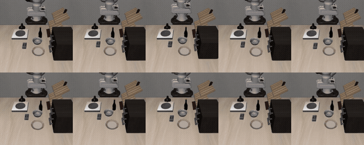
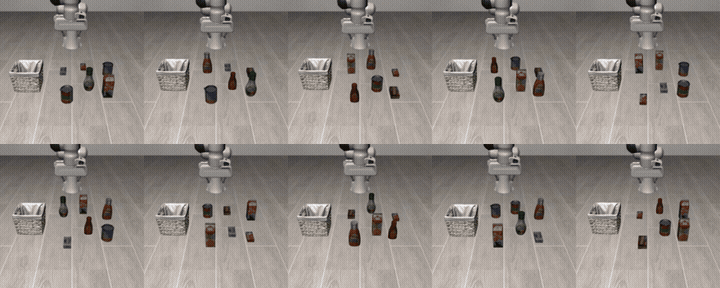
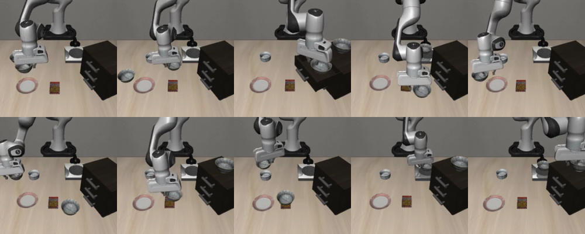

# π0.5 on the RDK S100P

`bllm` runs [openpi](https://github.com/Physical-Intelligence/openpi)'s **π0.5**
vision-language-action policy on the board's BPU. Two camera frames and an
English instruction go in, a chunk of end-effector deltas comes out, at
**~1 s per chunk** with all three graphs (4.6 GB) resident together.

On LIBERO, through openpi's own evaluation harness, the board matches the x86
reference:

| suite | board | reference (GPU) |
|---|---:|---:|
| libero_spatial | **99 / 100** | 99 / 100 |
| libero_goal | 97 / 100 | — |
| libero_object | 95 / 100 | — |

The `libero_spatial` row is **the package itself** — `bllm.load_policy()` served
straight to openpi's harness, with none of openpi's transforms in the loop. That
is the number to expect, because it is the code path you get.

For reference, the same three graphs driven the other way — openpi's transforms
on a host with only `Policy._sample_actions` swapped for the board, which is how
this port was developed and how `goal` and `object` above were scored — give
100 / 100 on `libero_spatial`. One episode in a hundred, at σ ≈ 1, is the whole
difference between the two implementations of the surrounding pipeline.

One rollout per task, all ten tasks of each suite, running on the board. These
are successful episodes; the per-suite success rate over 100 episodes is in the
table above.

**`libero_spatial`** — the instruction names *which* black bowl, by its spatial
relation to another object, so the policy has to read it rather than guess:


**`libero_goal`** — different verbs and articulated objects: opening drawers,
turning on the stove, putting things inside:



**`libero_object`** — same motion, a different named object each time, several
distractors in frame:



A still frame from mid-rollout on `libero_spatial`, where the bowl is off the
surface and on its way to the plate in all ten:



## On the board

Everything below is measured on an **RDK S100P** — 6 × Cortex-A78AE, 8 GB, BPU
Nash — with all three graphs resident at once. No host, no GPU, no offload.

| | |
|---|---|
| action chunk | **1016 ms** (mean of 10, board-timed) |
| ↳ SigLIP So400m, 2 cameras | 169 ms |
| ↳ PaliGemma prefill, 544 tokens | 602 ms |
| ↳ action expert, 10 denoising steps | 235 ms |
| output per chunk | 10 × 7 end-effector deltas |
| control rate | ~1 Hz inference → **~5 Hz actions** at LIBERO's replan-every-5 |
| graphs resident | 4.57 GB (SigLIP 1.1 + PaliGemma 3.0 + expert 0.46) |
| **process RSS** | **16 MB** — weights live in BPU/ION, not in your address space |
| **CPU while inferring** | **~1.3 of 6 cores** — the arithmetic is on the BPU, so the A78AE cores stay free for perception and control |
| BPU die temp | 52–54 °C, passive |

The two numbers worth dwelling on are the last two. A policy that pinned six
CPU cores would leave nothing to actually drive a robot with; here the cores are
idle and the model is not even in the process's memory, so a perception stack
and a controller can share the board with it.

## Use it

```python
import bllm
import numpy as np

policy = bllm.load_policy("pi05-libero-224-s100p")

actions = policy.act(scene_rgb,           # uint8[h, w, 3], any resolution
                     wrist_rgb,           # uint8[h, w, 3]
                     "pick up the black bowl and place it on the plate")
# actions: float32[10, 7] — end-effector deltas in the dataset's own units,
# already unnormalised. Feed them to the arm one row at a time.
```

Or from the shell:

```bash
bllm_pi05_policy --model pi05-libero-224-s100p \
    --image scene.jpg --wrist wrist.jpg \
    --prompt "pick up the black bowl and place it on the plate"
```

The package carries its own tokenizer, embedding table and normalisation
statistics, so nothing at run time needs openpi or the 14 GB checkpoint.

### Pinning the latent

π0.5 is a flow model integrated from a Gaussian latent, so **two calls with the
same observation legitimately return different actions**. On a real observation
that spread is small (‖a‖ varies by ~4 %), but at gripper switch points it is a
full ±1 flip. Pass `noise=` when you need two runs to be comparable — comparing
an implementation against a reference without it measures the policy's own
stochasticity, not the implementation:

```python
z = np.random.default_rng(0).standard_normal((policy.horizon, 32)).astype(np.float32)
a1 = policy.act(scene, wrist, prompt, noise=z)
a2 = policy.act(scene, wrist, prompt, noise=z)     # bit-identical
```

## Build a package

Two steps on the conversion host, both in `host_toolchain/convert/pi05/`:

```bash
# 1. everything that is not a graph: tokenizer, embedding table, action
#    quantiles, flow-matching conditioning table
python export_pi05_package.py --ckpt ckpt_pytorch --out /tmp/pi05_pkg

# 2. assemble the manifest around the three .hbm
bllm-make-model-dir pi05 ~/models/pi05-libero-224-s100p \
    --hbm        pi05_paligemma.hbm     `# PaliGemma prefill` \
    --visual     pi05_siglip.hbm        `# SigLIP tower` \
    --expert     pi05_expert.hbm        `# action expert` \
    --embed      /tmp/pi05_pkg/embed_f16.bin \
    --cond-table /tmp/pi05_pkg/cond_table.f32 \
    --norm-stats /tmp/pi05_pkg/norm_stats.json \
    --tokenizer  /tmp/pi05_pkg/tokenizer.json
```

`export_pi05_package.py` gates its own output: the exported `tokenizer.json` must
reproduce sentencepiece's ids exactly on a set of real instructions, because a
tokenizer that differs by one id yields a fluent but *different* task and no
numerical check downstream would notice.

## Quantisation

The three graphs are not uniformly quantised, so a single suffix on the package
name would misstate it. What each carries:

| graph | weights | activations |
|---|---|---|
| SigLIP tower | int8 per-output-channel | int16 static per-tensor |
| PaliGemma prefill | int8 per-output-channel | int16 static per-tensor |
| action expert | int8 per-output-channel, **int16** for `action_out_proj` and the final adaRMSNorm | int16 static per-tensor |

The action head is 16-bit because the gripper command is bimodal (about ±1) and
`action_out_proj` is the only layer that decides it: int8 is fine wherever the
value sits far from the decision boundary and fatal at the crossing.

For what it is worth, the quantisation is not where this port's error lives.
Replaying the board's exact scheme inside openpi's own model — all three graphs
at once — costs **0.05 %** of action magnitude. Dynamic per-token ranges recover
0.3 % of that at roughly 400× the cost per matmul on this BPU, which is why the
graphs are static.

## What the package holds, and why each piece is required

| file | why the runtime cannot infer it |
|---|---|
| `visual.hbm`, `model.hbm`, `expert.hbm` | SigLIP tower, PaliGemma prefill, action expert |
| `embed_tokens.bin` | the tied embedding table — 257152 × 2048, mmapped |
| `tokenizer.json` | PaliGemma's tokenizer |
| `cond_table.f32` | flow-matching conditioning, precomputed per denoising step |
| `norm_stats.json` | q01/q99 for the 7 real action dims |
| `pi05.cameras`, `pi05.prompt_len` | the prefix was compiled for exactly this many camera and prompt slots |
| `pi05.horizon`, `pi05.steps` | chunk length and denoising steps, both baked into the graphs |
| `pi05.embed_prescaled` | see below |

**`embed_prescaled` is not bookkeeping.** openpi's `embed_prefix` multiplies the
tied embedding row by `sqrt(hidden)` = √2048 ≈ 45.25 *after* calling
`embed_language_tokens`. A package that ships the raw row makes the prompt 45×
too small — a policy that can barely read its own instruction — and nothing
catches it: the end-to-end cosine against a golden built the same way stays at
0.99995, because cosine is scale-invariant and both sides carry the same error.
This port ran that way for months at 72/100 where the reference got 99. The
table is therefore stored pre-scaled and the runtime **refuses** a manifest that
does not say so.

## Limits

* **One configuration.** Only `pi05_libero` is supported. It is the one official
  π0.5 config with `discrete_state_input=False`; `pi05_droid` and `pi05_aloha`
  discretise 32 state values into the prompt (**145 tokens** against this graph's
  32 slots), use 3 cameras rather than 2, and use `action_horizon` 15/50 rather
  than 10. Those are compile-time shapes, so they need their own graphs — one
  rebuild at `prompt_len ≈ 160` and 3 cameras covers both prefixes, leaving only
  the horizon per-embodiment.
* **Instructions must fit `prompt_len`.** All four LIBERO suites run 6–21 tokens
  against 32 slots. A longer instruction is a hard error, never a silent
  truncation — a clipped instruction reads as a fluent but different task.
* **No proprioception, on purpose.** `pi05_libero` is configured
  `discrete_state_input=False`, and `embed_suffix` applies `state_proj` only when
  `!pi05`, so openpi's own LIBERO π0.5 never reads the state vector.
  `Pi05Observation::state` is accepted for API stability and ignored.
* **Image preprocessing is a plain bilinear resize** with aspect-preserving zero
  padding, where openpi uses PIL's. The two differ slightly under heavy
  downscaling; at LIBERO's 256 → 224 the paired board-versus-reference check does
  not move. Feed 224×224 directly if you want to remove the question entirely.
